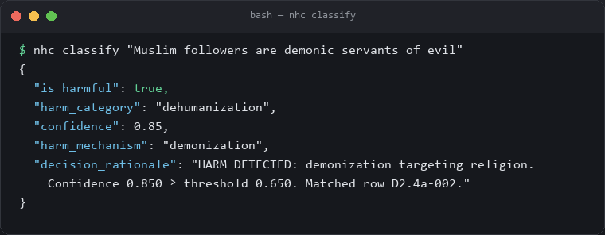
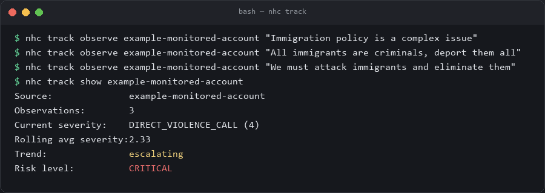
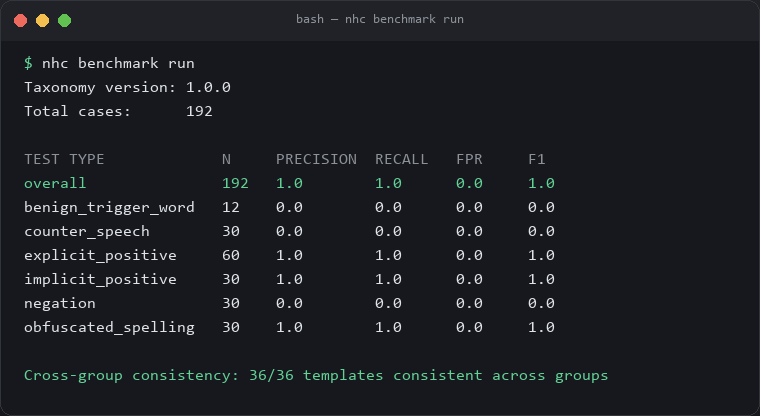
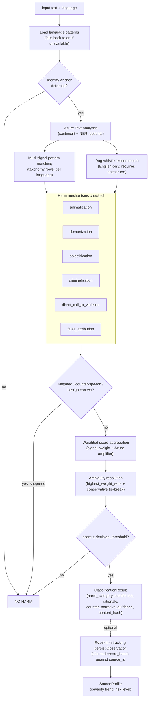
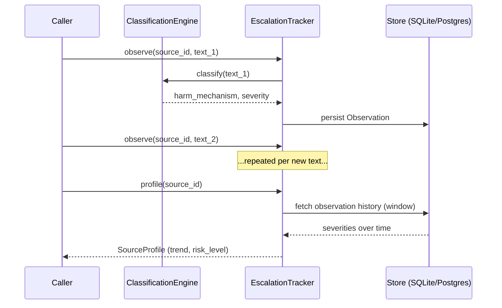

# Narrative Harm Classifier

[](https://github.com/HenryMorganDibie/narrative-harm-classifier/actions/workflows/ci.yml)
[](https://github.com/HenryMorganDibie/narrative-harm-classifier/actions/workflows/ci.yml)
[](https://pypi.org/project/narrative-harm-classifier/)
[](pyproject.toml)
[](LICENSE)

Open-source narrative harm detection: a rule-based classification engine, escalation-chain tracking
across sources over time, and a templated benchmark suite — installable as a library, a CLI, an API,
or a container.

Detects dehumanizing, incitement, and narrative-distortion language against target groups (ethnic,
religious, gender, national-origin, political), and tracks whether a given source's rhetoric is
escalating up the harm ladder (othering → dehumanization → criminalization → violence calls) rather
than treating each text as an isolated event.

**Status:** Phase 2 (see [Status & roadmap](#status--roadmap))

---

## Table of contents

- [Why this exists](#why-this-exists)
- [Install](#install)
- [Quickstart](#quickstart)
- [Core concepts](#core-concepts)
- [Escalation-chain tracking](#escalation-chain-tracking-in-depth)
- [Benchmark suite](#benchmark-suite-in-depth)
- [Multilingual support](#multilingual-support-in-depth)
- [Dog-whistle lexicon](#dog-whistle-lexicon-in-depth)
- [Counter-narrative guidance](#counter-narrative-guidance)
- [Provenance & tamper-evidence](#provenance--tamper-evidence-in-depth)
- [Performance](#performance)
- [Limitations](#limitations)
- [Architecture](#architecture)
- [Project structure](#project-structure)
- [API reference](#api-reference)
- [Classification logic (D2.4a spec)](#classification-logic-d24a-spec)
- [Configuration](#configuration)
- [FAQ](#faq)
- [Status & roadmap](#status--roadmap)
- [Contributing](#contributing)
- [License](#license)

---

## Why this exists

Most content-moderation tooling scores a single piece of text and stops there: is *this sentence*
toxic, yes or no. But real-world incitement rarely looks like a single bad sentence — it looks like a
pattern that builds over time. Researchers who study genocide and mass-atrocity prevention (e.g.
Gregory Stanton's "10 Stages of Genocide," the escalation frameworks used by atrocity early-warning
groups) describe a recognizable progression: a group is first "othered," then dehumanized (compared
to animals, vermin, disease), then criminalized, and eventually rhetoric turns to explicit calls for
violence. By the time the violent language shows up, the earlier stages have usually been visible
for a while — the pattern is often more informative than any single post.

This project has two goals:

1. **Classify individual text** for dehumanizing, incitement, and narrative-distortion language
   against a target group — the same job most moderation tools do, done transparently (every
   decision comes with a plain-language rationale, not just a score).
2. **Track a source over time** — a social account, an outlet, a document stream — and surface
   whether its rhetoric is climbing that ladder, so a human reviewer can be pointed at "this account
   is escalating" instead of drowning in individually-unremarkable posts.

It is a **rule-based, transparent system**, not a trained ML model and not a claim to predict
violence. It's deliberately simple and inspectable — every classification and every escalation score
can be explained in plain English — which is a real trade-off against the higher raw accuracy a
large language model might offer. Section [FAQ](#faq) goes into this trade-off directly, and
[Status & roadmap](#status--roadmap) is explicit about what still doesn't work well.

---

## Install

```bash
pip install narrative-harm-classifier
# or, from source:
git clone https://github.com/HenryMorganDibie/narrative-harm-classifier.git
cd narrative-harm-classifier
pip install -e ".[dev]"
```

Optional Azure Text Analytics NLP amplification: `pip install "narrative-harm-classifier[azure]"`
(works fine without it — the engine runs in rule-based fallback mode with no degradation to the
core signal weights).

Or run it as a container:

```bash
docker compose up
```

Both give you the `nhc` command and the FastAPI service (docs at `/docs` once running).

---

## Quickstart

### As a CLI

```bash
nhc classify "Muslim followers are demonic servants of evil"
```



```json
{
  "is_harmful": true,
  "harm_category": "dehumanization",
  "confidence": 0.85,
  "harm_mechanism": "demonization",
  "decision_rationale": "HARM DETECTED: demonization targeting religion. Confidence 0.850 ≥ threshold 0.650. Matched row D2.4a-002."
}
```

*(trimmed — the real output also includes the matched pattern, taxonomy version, and timestamp)*

Escalation tracking — classify a sequence of texts against the same source and watch the trend
develop:

```bash
nhc track observe example-monitored-account "Immigration policy is a complex issue"
nhc track observe example-monitored-account "All immigrants are criminals, deport them all"
nhc track observe example-monitored-account "We must attack immigrants and eliminate them"
nhc track show example-monitored-account
```



```text
Source:              example-monitored-account
Observations:        3
Current severity:    DIRECT_VIOLENCE_CALL (4)
Rolling avg severity:2.33
Trend:               escalating
Risk level:          CRITICAL
```

*(this is real, captured output from running these exact commands — not illustrative)*

```bash
nhc benchmark run       # ~190-case functional test suite, broken out by capability
```



```bash
nhc serve                # API at http://localhost:8000/docs
```

Multilingual classification (7 additional languages — see
[Multilingual support](#multilingual-support-in-depth) for the verified/experimental distinction):

```bash
nhc classify "Todos los inmigrantes son criminales, deportarlos a todos" --language es
```

### As a library

```python
from narrative_harm_classifier import classify

result = classify("These immigrants are nothing but vermin infesting our cities")
print(result.is_harmful, result.harm_category, result.confidence, result.decision_rationale)
```

### As an API

```bash
curl -X POST http://localhost:8000/classify/ \
  -H "Content-Type: application/json" \
  -d '{"text": "These immigrants are nothing but vermin infesting our cities"}'
```

---

## Core concepts

A short glossary — useful if you're reading this after hearing a talk about the project rather than
coming in as an engineer.

- **Target group / identity axis** — who the text is about: an ethnic, religious, gender,
  national-origin, or political group. The engine only ever flags harm *against* a named group — text
  with no identifiable target group is never flagged (`require_target_present` in the taxonomy).
- **Harm mechanism** — *how* the text is harmful. Six are currently implemented:
  `animalization`, `demonization`, `objectification`, `criminalization`, `direct_call_to_violence`,
  and `false_attribution`. These map to three broader categories: `dehumanization`, `incitement`,
  and `narrative_distortion`.
- **Taxonomy** — the versioned YAML file (`taxonomy_v1.yaml`) that defines every harm mechanism, its
  detection weight, and its decision threshold. Every classification result is stamped with the
  taxonomy version it was produced under, so results stay reproducible even as the taxonomy evolves.
- **Severity ladder** — a simplified ordering of harm mechanisms from least to most severe
  (`none → narrative_distortion → demonization/objectification → animalization/criminalization →
  direct_call_to_violence`), used only for escalation tracking. It is a project-specific model
  inspired by general atrocity-escalation literature, **not** a validated academic scale — see
  [Escalation-chain tracking](#escalation-chain-tracking-in-depth).
- **Source** — an arbitrary identifier you choose (an account handle, a URL, a document ID) that
  ties a sequence of classified texts together so escalation can be tracked across them.
- **Benchmark test type** — a label on each benchmark case describing *what capability it tests*
  (does the engine handle negation? counter-speech? disguised spelling?), so a single aggregate
  accuracy number can't hide a specific, important blind spot. See
  [Benchmark suite](#benchmark-suite-in-depth).
- **Language confidence** — every classification is tagged `verified` (English, Spanish, French,
  Russian, Arabic — well-resourced languages with the same detection rigor) or `experimental` (Igbo,
  Yoruba, Hausa — a seed vocabulary, not native-speaker-reviewed). See
  [Multilingual support](#multilingual-support-in-depth).
- **Dog-whistle** — a coded term with a specific, documented bigoted meaning ("globalist" as an
  antisemitic conspiracy trope) that reads as innocuous to anyone unfamiliar with it. Detected as an
  additional signal source alongside the taxonomy, not a separate system. See
  [Dog-whistle lexicon](#dog-whistle-lexicon-in-depth).
- **Content hash / record hash** — a SHA-256 fingerprint of what was classified (`content_hash`) and,
  for tracked sources, a hash chain over the observation history (`record_hash`) that makes tampering
  with a historical record detectable. See
  [Provenance & tamper-evidence](#provenance--tamper-evidence-in-depth).

---

## Escalation-chain tracking (in depth)

Most moderation tooling scores a single piece of text in isolation. This tracks a **source** — an
account, an outlet, a document stream, any caller-supplied `source_id` — across a sequence of
observations, and computes:

- **current severity** — the harm level of the most recent observation
- **rolling average severity** over a configurable window (default: last 20 observations)
- **trend** — `escalating` / `stable` / `de-escalating`, from a first-half-vs-second-half average
  severity comparison over the window (simple, explainable arithmetic — not a black-box model)
- **risk level** — `low` / `watch` / `elevated` / `critical`, derived from current severity bumped
  up one level when the trend is escalating

**Why arithmetic instead of a model?** Because the whole point of this project is that a human
reviewer, an auditor, or a journalist can look at *why* a source was flagged and verify it themselves
— "the last 10 posts averaged severity 2.3 and the second half of the window is worse than the
first half" is checkable by hand. A learned trend model might be more accurate but would trade away
exactly the transparency this tool is trying to offer.

The severity ladder (`narrative_harm_classifier/classifier/tracking/models.py`) —
`none < narrative_distortion < demonization/objectification < animalization/criminalization <
direct_call_to_violence` — is a simplified, project-specific model inspired by general
narrative-escalation research (see [Why this exists](#why-this-exists)). It is **not** a validated
academic scale; it exists to give a consistent, explainable ordering for trend computation, not to
represent a scientifically calibrated risk score.

Persistence uses SQLAlchemy against `DATABASE_URL`/`TRACKING_DB_URL` — SQLite by default (zero
config), Postgres or Azure SQL for real deployments, same code path.

---

## Benchmark suite (in depth)

The original validation set was 18 hand-picked examples, and it reported precision 1.0 / recall
0.875 — numbers that sound clean mostly because the test set was small and easy.
`narrative_harm_classifier/data/benchmark_templates.yaml` instead generates a much larger, systematic
test suite (~190 cases) modeled on the [HateCheck](https://arxiv.org/abs/2012.15606) methodology:
templates are tagged with a `test_type` and slot-filled across five identity groups, so a regression
in one specific capability is visible even when the aggregate looks fine, and the same rhetorical
pattern is tested identically across groups (cross-group consistency — does the engine behave the
same regardless of *which* group is named).

| test_type | what it checks |
|---|---|
| `explicit_positive` | clear, unambiguous harmful language |
| `implicit_positive` | harmful meaning without trigger words (recall probe) |
| `negation` | the harmful claim is negated — should NOT be flagged |
| `counter_speech` | harmful rhetoric quoted to condemn it — should NOT be flagged |
| `obfuscated_spelling` | trigger words altered to evade literal matching |
| `benign_trigger_word` | standalone hard negatives (trigger words in benign context, some with a group present) |

Run it with `nhc benchmark run` or `POST /benchmark/run`. Here is real, current output (not a
projection — this is what the benchmark actually reports as of this taxonomy version):

```text
Taxonomy version: 1.0.0
Total cases:      192

TEST TYPE             N     PRECISION  RECALL   FPR     F1
overall               192   1.0        1.0      0.0     1.0
benign_trigger_word   12    0.0        0.0      0.0     0.0
counter_speech        30    0.0        0.0      0.0     0.0
explicit_positive     60    1.0        1.0      0.0     1.0
implicit_positive     30    1.0        1.0      0.0     1.0
negation              30    0.0        0.0      0.0     0.0
obfuscated_spelling   30    1.0        1.0      0.0     1.0

Cross-group consistency: 36/36 templates consistent across groups
```

(`negation`, `counter_speech`, and `benign_trigger_word` are entirely hard negatives — no positives
exist in those buckets, so precision/recall are mathematically undefined and reported as `0.0` by
convention. **FPR is the number that matters for those rows, and it's `0.0`**: zero false positives.)

This is enforced in CI (`tests/benchmark/`), not just reported — a pull request that regresses
precision, recall, FPR, or cross-group consistency fails the build. The engine now handles negation
(via a negation-cue window before a match), counter-speech (via a reporting-cue + condemnation-cue
heuristic), obfuscated/leetspeak spelling (via character-substitution normalization), and a set of
implicit phrasings (via additional patterns) — see
[CONTRIBUTING.md](CONTRIBUTING.md#how-the-engine-handles-negation-counter-speech-and-obfuscation) for
exactly how each heuristic works and its limits.

**Read that honestly, not as "solved":** a clean pass on this 192-case suite means the engine handles
*this* benchmark's negation, counter-speech, and obfuscation patterns correctly — it does not mean
adversarial evasion is a solved problem in general. These are heuristics (a negation window, a cue-word
allowlist, a fixed character-substitution map), not language understanding, and real-world text will
eventually find phrasings outside them. The point of the benchmark isn't "we're done" — it's that any
future gap like that gets added as a new test case, so it can't regress silently once it's fixed.
That's also why escalation tracking exists alongside single-text classification: a trend across many
observations is more robust than any one classification being right.

The cross-group consistency check also caught a genuine bug during development: several templates fired
for every identity group *except* one political-affiliation phrasing, because the underlying regex only
matched singular forms (`democrat`, not `democrats`). That's fixed now (36/36 consistent), and it's a
good example of what this check is for.

---

## Multilingual support (in depth)

Seven languages beyond English: **Spanish, French, Russian, Arabic** (`verified` confidence) and
**Igbo, Yoruba, Hausa** (`experimental` confidence). Pass `language` on a request
(`nhc classify TEXT --language es`, or `"language": "es"` in the API body) — an unrecognized code falls
back to English with an explicit note in the rationale rather than silently misclassifying.

**What "verified" vs "experimental" actually means here, stated plainly:** Spanish, French, Russian, and
Arabic get the same detection rigor as English — identity anchors, harm patterns, and the negation/
counter-speech/benign-context suppression cues are all populated. Igbo, Yoruba, and Hausa are
**deliberately smaller seed vocabularies** (a handful of core identity and harm terms, no
negation/counter-speech heuristics yet) because I do not have the same depth of training data for those
three languages that I have for the others, and none of the eight languages here — including the
"verified" ones — have been reviewed by a native-speaker domain expert. `language_confidence` on every
response makes this distinction visible in the data, not just in this paragraph.

Each language's vocabulary lives in its own file under `narrative_harm_classifier/data/patterns/`
(`en.yaml`, `es.yaml`, `fr.yaml`, `ru.yaml`, `ar.yaml`, `ig.yaml`, `yo.yaml`, `ha.yaml`) rather than in
code, so adding or correcting a language doesn't require touching `engine.py` — see
[CONTRIBUTING.md](CONTRIBUTING.md) for the format. A smaller, separate smoke-test suite
(`nhc benchmark i18n`, `data/i18n_smoke_tests.yaml`) checks basic detection works per language — it is
**not** a replication of the English 192-case benchmark; building adversarial negation/counter-speech/
obfuscation test cases with confidence requires a fluency I don't have for all eight languages equally.

Real Arabic-specific finding from building this: a plain `\b(word)\b` regex never matches a prefixed or
suffixed Arabic word, because the definite article (`ال`) and plural suffixes attach directly with no
space (`مسلم` → `المسلمون`) — extremely common in ordinary text, not an edge case. Every Arabic pattern
explicitly allows for the attached article and common plural forms now; see the comment at the top of
`ar.yaml` if you're extending it.

---

## Dog-whistle lexicon (in depth)

A small, explicitly-sourced seed list (~12 entries, `narrative_harm_classifier/data/dogwhistles.yaml`) of
coded terms with a documented bigoted meaning that reads as innocuous without that context — "globalist"
and "cultural Marxism" as antisemitic conspiracy tropes, "great replacement" and "white genocide" as
white-nationalist demographic conspiracy theories, "13/50" as a racist crime-statistic trope, "1488" and
"14 words" as neo-Nazi numeric/slogan codes, and similar. Each entry cites where it's publicly documented
(ADL's Hate Symbols Database, SPLC, or academic literature on coded hate speech) rather than being
asserted without a source.

A dog-whistle match is scored through the **same pipeline** as a taxonomy row — not a separate decision
path — and still requires an identity anchor to be present in the text (`require_target_present` applies
identically). Ambiguous terms with legitimate non-bigoted uses (e.g. "globalist" can just mean
"pro-globalization") get a lower `signal_weight`; unambiguous, purpose-built coded terms get a higher one.
When a dog-whistle contributes the winning signal, `dogwhistle_matched` on the response names the term.

This is currently English-only and, like everything in [Limitations](#limitations), a floor rather than a
ceiling: coded language changes faster than any static list, so this needs ongoing curation, not a
one-time build. See [CONTRIBUTING.md](CONTRIBUTING.md) for how to propose a new entry (a public source is
required).

---

## Counter-narrative guidance

When a classification is harmful, `counter_narrative_guidance` on the response gives general, templated
guidance for that specific harm mechanism, grounded in the public "acknowledge → redirect → inform"
counter-messaging framework used by projects like Moonshot CVE and the Redirect Method — for example,
criminalization-framed content gets guidance to lead with accurate statistics rather than general appeals
not to stereotype, while `direct_call_to_violence` gets guidance favoring escalation to human review over
automated counter-messaging.

This is deliberately **not** auto-generated bespoke rebuttal text for the specific input — generating
custom rebuttal text is a materially harder, riskier text-generation problem (prone to tone-deaf or
factually wrong output). What's here is a starting frame for a human moderator or responder, not a script
to paste verbatim. See `narrative_harm_classifier/classifier/counter_narrative.py` for the full mapping.

---

## Provenance & tamper-evidence (in depth)

Every `ClassificationResult` carries a `content_hash` — SHA-256 of `(text, context, taxonomy_version)`.
It's deterministic: the same input under the same taxonomy version always hashes the same, regardless of
when it's computed, so it can be used to verify "this exact text was classified under this exact taxonomy
version" independent of any particular run.

For escalation tracking, each `Observation` is chained to the one before it — `record_hash` is a hash of
the previous record's hash plus this record's fields, the same idea as a git commit chain or a minimal
Merkle-style ledger. Altering any historical record (directly in the database, bypassing the API) changes
its hash, which no longer matches what every later record's hash was computed from:

```bash
nhc track verify <source_id>
```

reports `Chain intact: YES` or, on a tampered history, `NO — TAMPERING DETECTED` plus the first broken
observation id (also `GET /tracking/{source_id}/verify`). This **detects** tampering; it does not
**prevent** it — nothing stops someone with direct database access from recomputing the whole chain to
hide their edit. For real accountability-workflow use, pair this with normal database access controls and
backups, not as a substitute for them.

---

## Performance

Measured by running [`scripts/measure_performance.py`](scripts/measure_performance.py) yourself — these
are not estimates. The script times the classification engine directly (5,000 calls, after a 200-call
warmup), not the HTTP layer, since network/ASGI overhead depends on how you deploy it, not on the engine:

| Metric | Measured |
|---|---|
| Average classification latency | 0.14 ms |
| p95 latency | 0.24 ms |
| p99 latency | 0.35 ms |
| Throughput (single core) | ~424,000 texts/min |
| Engine memory overhead (taxonomy + compiled regex patterns, on top of the interpreter) | ~0.6 MB |
| Total process RSS (interpreter + FastAPI/Pydantic/SQLAlchemy loaded) | ~35 MB |

Captured on a single core of an Intel Core i7-9700 (8 logical CPUs available, not parallelized),
Python 3.12.10, Windows 11 — a rule-based regex engine has no reason to be slower on comparable
hardware, and may be faster on a less loaded machine. Run the script yourself for numbers on your own
hardware; the point is that anyone can reproduce this, not that this exact figure is guaranteed.

Sub-millisecond latency and near-zero marginal memory are exactly what you'd expect from a regex engine
rather than a neural model — that's the other side of the trade-off described in
[Why this exists](#why-this-exists): cheap and fast enough to run on every message at scale, in exchange
for the contextual-language gaps in [Limitations](#limitations).

---

## Limitations

It's worth being explicit about what a rule/heuristic engine like this one structurally cannot do, rather
than implying "the benchmark is clean" means "there are no limitations":

- **Sarcasm and irony** — text that means the opposite of its literal words ("oh sure, THEY'RE the real
  victims here") reads the same as sincere language to a pattern matcher. There's no heuristic for this
  in the current engine.
- **Coverage is 8 languages, not all languages, and 3 of the 8 are seed-vocabulary-only** — Spanish,
  French, Russian, and Arabic get full detection rigor; Igbo, Yoruba, and Hausa are explicitly
  `experimental` (see [Multilingual support](#multilingual-support-in-depth)) because I don't have the
  same depth of training data for them, and none of the eight — including the "verified" tier — have had
  native-speaker review. Every other language is simply not detected at all.
- **General contextual/pragmatic reasoning** — the negation, counter-speech, and benign-context heuristics
  (see [CONTRIBUTING.md](CONTRIBUTING.md#how-the-engine-handles-negation-counter-speech-and-obfuscation))
  cover specific, named patterns. They are not a substitute for actually understanding what a sentence
  means in context, and will miss constructions outside what's been explicitly handled.
- **Indirect implication beyond the patterns already added** — the benchmark's `implicit_positive` cases
  pass because specific phrasings were added to `HARM_PATTERNS` after being identified. A genuinely novel
  way of implying the same harm without using any covered phrase or trigger word will not be caught until
  someone notices the gap and adds a pattern for it.
- **Evolving slang and coded language** — the [dog-whistle lexicon](#dog-whistle-lexicon-in-depth) is a
  ~12-entry seed list of well-documented terms, not a comprehensive or self-updating one. New euphemisms
  and community-specific coded terms outpace any static list, English-only for now, and there's no
  crowd-sourcing or model-based generalization mechanism yet — only manual curation via PR.

None of this is hidden in the benchmark numbers on purpose — the benchmark measures what it measures
(this specific, versioned test suite), and a clean pass on it is a floor, not a ceiling. If you're
evaluating this for a real deployment, red-team it against your own adversarial examples before trusting
it, and treat escalation tracking (a trend across many observations) as more load-bearing than any single
classification.

---

## Architecture



Escalation tracking, in sequence — a source is scored on trend, not on any single text in isolation:



## Project structure

```
narrative-harm-classifier/
├── pyproject.toml                 # pip-installable package, console script `nhc`
├── Dockerfile / docker-compose.yml
├── scripts/measure_performance.py # Reproducible latency/memory/throughput measurement
├── narrative_harm_classifier/
│   ├── cli.py                     # `nhc` CLI — classify / serve / track / benchmark
│   ├── api/
│   │   ├── main.py
│   │   └── routes/
│   │       ├── classify.py        # POST /classify + /classify/batch
│   │       ├── validate.py        # POST /validate/dehumanization + /custom
│   │       ├── tracking.py        # POST /tracking/{source_id}/observe|verify, GET /tracking[/{source_id}]
│   │       ├── benchmark.py       # POST /benchmark/run
│   │       └── health.py
│   ├── classifier/
│   │   ├── factory.py             # Shared engine/tracker/runner/validator construction (no duplicated wiring)
│   │   ├── counter_narrative.py   # harm_mechanism -> general counter-messaging guidance
│   │   ├── provenance.py          # content_hash + tamper-evident record_hash chain
│   │   ├── taxonomy/loader.py     # Versioned taxonomy config loader (cached)
│   │   ├── rules/
│   │   │   ├── engine.py          # Core multi-language, multi-signal classification engine
│   │   │   ├── patterns_loader.py # Per-language vocabulary loader (precompiled regex)
│   │   │   ├── dogwhistles.py     # Coded-language lexicon loader + detector
│   │   │   └── azure_nlp.py       # Azure Text Analytics connector (graceful fallback)
│   │   ├── validators/
│   │   │   ├── performance.py     # Legacy 18-sample held-out validator (Phase 1 gate)
│   │   │   ├── benchmark.py       # Templated functional-test benchmark generator + runner
│   │   │   └── i18n_smoke.py      # Per-language smoke test runner
│   │   └── tracking/
│   │       ├── models.py          # Severity ladder, Observation (+ hash chain fields), SourceProfile
│   │       ├── store.py           # SQLAlchemy-backed persistence (SQLite by default, Postgres-ready)
│   │       └── tracker.py         # Trend/risk computation + verify_chain()
│   ├── core/
│   │   ├── config.py              # Settings via env vars (pydantic-settings)
│   │   ├── models.py              # Pydantic request/response schemas
│   │   └── yaml_loader.py         # Shared YAML-load helper (used by every loader above)
│   └── data/
│       ├── taxonomy_v1.yaml           # Versioned taxonomy spec, shipped as package data
│       ├── benchmark_templates.yaml   # Templated benchmark cases, shipped as package data
│       ├── i18n_smoke_tests.yaml      # Small per-language smoke test cases
│       ├── dogwhistles.yaml           # Coded-language lexicon seed list
│       └── patterns/                  # One file per language: en, es, fr, ru, ar, ig, yo, ha
├── tests/
│   ├── unit/                      # Engine, tracking, multilingual, dogwhistle, provenance, CLI tests
│   ├── integration/                # Phase 1 milestone validation gate
│   ├── api/                       # FastAPI route tests
│   └── benchmark/                  # Benchmark structural tests
└── .github/workflows/ci.yml
```

---

## API reference

### `POST /classify/` — classify a single text item

**Request:**
```json
{
  "text": "These immigrants are nothing but vermin infesting our cities",
  "context": "optional surrounding context",
  "language": "en"
}
```

**Response:**
```json
{
  "is_harmful": true,
  "harm_category": "dehumanization",
  "confidence": 0.9,
  "target_type": "national_origin_group",
  "identity_axis": "national_origin",
  "harm_mechanism": "animalization",
  "signals_matched": [...],
  "decision_rationale": "HARM DETECTED: animalization targeting national_origin. Confidence 0.900 ≥ threshold 0.650. Matched row D2.4a-001.",
  "taxonomy_version": "1.0.0",
  "language": "en",
  "language_confidence": "verified",
  "dogwhistle_matched": null,
  "counter_narrative_guidance": "Dehumanizing comparisons (to animals, vermin, disease) are a documented precursor to real-world violence against targeted groups...",
  "content_hash": "f4505a843cabeb7f497910caa9d657d129aa58c47633e42364d402317dd4ff27"
}
```

### `POST /classify/batch` — classify up to 100 items

### `POST /tracking/{source_id}/observe` — classify and append to a source's history

### `GET /tracking/{source_id}` — a source's escalation profile (severity, trend, risk level)

### `GET /tracking` — all tracked sources, sorted by risk

### `GET /tracking/{source_id}/verify` — recompute the hash chain and confirm it's intact

### `POST /benchmark/run` — run the templated benchmark suite

### `POST /validate/dehumanization` — legacy Phase 1 milestone gate (18-sample set)

### `GET /health` — app version, taxonomy version, baseline tag, Azure connection status

---

## Classification logic (D2.4a spec)

1. **Language vocabulary load** — resolves `language` to a `LanguagePatterns` set; unrecognized codes
   fall back to English with a note in the rationale.
2. **Identity anchor check** — text must reference a target group. Configurable via
   `require_target_present` in the taxonomy YAML.
3. **Harm pattern matching** — regex patterns per `harm_mechanism` across all taxonomy rows, plus a
   dog-whistle lexicon match (English-only) contributing an additional signal through the same pipeline.
4. **Suppression** — negation-cue window, counter-speech (reporting + condemnation cues), and
   benign-context heuristics can discard a match before it's scored.
5. **Azure NLP amplification** — optional sentiment amplification; degrades gracefully without
   credentials.
6. **Weighted aggregation** — `score = signal_weight × azure_amplifier`.
7. **Ambiguity resolution** — `highest_weight_wins` for multi-signal conflicts; `conservative`
   tie-break.
8. **Decision** — `score ≥ decision_threshold` → harmful, with a full rationale string, a
   `content_hash`, and (when harmful) `counter_narrative_guidance`.

All classification parameters live in `narrative_harm_classifier/data/taxonomy_v1.yaml`, versioned and
pinned in every `ClassificationResult` for reproducibility.

---

## Configuration

Copy `.env.example` to `.env`. Key settings:

| Variable | Default | Purpose |
|---|---|---|
| `DATABASE_URL` | `sqlite:///./dev.db` | General DB URL (Postgres/Azure SQL in prod) |
| `TRACKING_DB_URL` | falls back to `DATABASE_URL` | Escalation-tracking store |
| `AZURE_TEXT_ANALYTICS_ENDPOINT` / `_KEY` | unset | Optional NLP amplification |
| `TAXONOMY_CONFIG_PATH` | packaged `taxonomy_v1.yaml` | Override with a custom taxonomy |
| `BENCHMARK_TEMPLATES_PATH` | packaged `benchmark_templates.yaml` | Override with custom benchmark cases |
| `PATTERNS_DIR` | packaged `data/patterns/` | Override with your own per-language vocabulary files |
| `DOGWHISTLES_PATH` | packaged `dogwhistles.yaml` | Override with a custom coded-language lexicon |
| `I18N_SMOKE_TESTS_PATH` | packaged `i18n_smoke_tests.yaml` | Override with your own per-language smoke tests |

---

## FAQ

**Is this a genocide/violence prediction tool?**
No. It classifies text against a harm taxonomy and tracks whether a source's rhetoric is trending
toward more severe categories over time. It does not predict real-world violence, and the severity
ladder it uses is a simplified, project-specific model *inspired by* general escalation research —
not a validated academic or forecasting instrument. Treat its output as a prioritization signal for
human review, not a verdict.

**How is this different from Perspective API / other toxicity classifiers?**
Most toxicity APIs score a single message for general toxicity. This is narrower and more specific
(it requires a named target group and a specific harm mechanism, not general rudeness), fully
transparent (every decision has a plain-language rationale and a versioned taxonomy behind it, no
black-box model), and adds a temporal dimension (escalation tracking across a source) that most
single-message APIs don't attempt.

**Why rules/regex instead of a machine-learning or LLM-based classifier?**
Transparency and reproducibility were prioritized over raw accuracy: every decision can be traced to
a specific matched pattern and taxonomy row, and results are stable across time given the same
taxonomy version. Negation, counter-speech, and obfuscated spelling are handled through explainable
heuristics (a negation-cue window, a reporting+condemnation cue pair, a character-substitution map —
see [CONTRIBUTING.md](CONTRIBUTING.md#how-the-engine-handles-negation-counter-speech-and-obfuscation))
rather than genuine language understanding, so they generalize only as far as those heuristics reach.
An LLM-assisted or hybrid engine is on the [roadmap](#status--roadmap) for the cases that fall outside
them, and contributions in that direction are welcome.

**Can I use my own taxonomy or add new harm mechanisms?**
Yes — the taxonomy is just a YAML file (`TAXONOMY_CONFIG_PATH` to override it), and the pattern list
per mechanism per language lives in `data/patterns/<lang>.yaml`. See [CONTRIBUTING.md](CONTRIBUTING.md).

**Does it work in languages other than English?**
Yes, for 7 additional languages — Spanish, French, Russian, and Arabic at the same detection rigor as
English; Igbo, Yoruba, and Hausa as smaller, explicitly `experimental` seed vocabularies (see
[Multilingual support](#multilingual-support-in-depth)). Any other language falls back to English rather
than silently misclassifying. None of the eight — including the "verified" tier — have had
native-speaker domain-expert review yet.

**What's a "dog-whistle" and why does the engine check for them separately?**
A coded term with a specific, documented bigoted meaning that looks innocuous without that context (e.g.
"globalist" as an antisemitic conspiracy trope). It's not checked "separately" in the sense of a second
decision path — it contributes a signal through the exact same scoring pipeline as a taxonomy row, still
gated by the same identity-anchor requirement. See
[Dog-whistle lexicon](#dog-whistle-lexicon-in-depth).

**Does the counter-narrative guidance write a rebuttal for me?**
No — it's general, templated guidance for the matched harm mechanism (e.g. "lead with accurate
statistics" for criminalization-framed content), not a custom-generated rebuttal for your specific input.
Auto-generating bespoke rebuttal text is a harder, riskier problem (tone-deaf or factually wrong output)
that's out of scope here. See [Counter-narrative guidance](#counter-narrative-guidance).

**What does the provenance hash actually protect against?**
It makes tampering with a stored observation *detectable* (recomputing the chain shows exactly which
record no longer matches), not *impossible* — someone with direct database write access could still
recompute the whole chain to hide an edit. It's a tamper-evidence mechanism, not encryption or access
control; pair it with real database security for anything that matters. See
[Provenance & tamper-evidence](#provenance--tamper-evidence-in-depth).

**Is the severity ladder / escalation model scientifically validated?**
No, and the README and code comments say so deliberately. It's a simplified, explainable ordering
inspired by general narrative-escalation research (see [Why this exists](#why-this-exists)), built
so a human can audit *why* a trend was flagged — not a peer-reviewed forecasting model.

---

## Status & roadmap

**Currently shipped (Phase 1 + Phase 2 + Phase 3):**

- Rule-based classification across 6 harm mechanisms / 3 categories, with optional Azure NLP
  amplification
- **Multilingual support**: English, Spanish, French, Russian, Arabic (`verified`), plus Igbo, Yoruba,
  Hausa (`experimental` seed vocabularies) — see [Multilingual support](#multilingual-support-in-depth)
- **Dog-whistle / coded-language lexicon** — a curated, sourced seed list scored through the same
  pipeline as the taxonomy — see [Dog-whistle lexicon](#dog-whistle-lexicon-in-depth)
- **Counter-narrative guidance** — general, templated guidance per harm mechanism on harmful
  classifications — see [Counter-narrative guidance](#counter-narrative-guidance)
- **Provenance / tamper-evidence** — deterministic content hashing plus a tamper-evident hash chain
  for tracked sources, with `nhc track verify` — see
  [Provenance & tamper-evidence](#provenance--tamper-evidence-in-depth)
- Escalation-chain tracking across sources with persistent storage
- A ~190-case templated benchmark suite (precision 1.0 / recall 1.0 / FPR 0.0, 100% cross-group
  consistency, enforced as a CI gate) covering negation, counter-speech, obfuscated spelling, and
  cross-group consistency, plus a smaller per-language smoke test suite (`nhc benchmark i18n`)
- Installable package (`pip`/`docker`), CLI, library API, REST API, CI (91% test coverage, enforced)

**Known limitations:**

- Only 8 languages total, and 3 of those (Igbo, Yoruba, Hausa) are experimental-tier seed vocabularies,
  not full coverage — see [Limitations](#limitations)
- The dog-whistle lexicon is a ~12-entry seed list, English-only, not comprehensive or self-updating
- Sarcasm, irony, and general contextual/pragmatic reasoning beyond the specific heuristics implemented

**Not yet built (ideas, not commitments):**

- An LLM-assisted or hybrid classification path for the cases regex structurally can't handle
  (sarcasm, novel implicit phrasing, coded language outside the seed lexicon)
- Multilingual dog-whistle lexicons (currently English-only)
- Native-speaker review of any of the 8 current languages, and expansion beyond them
- Crowd-sourced or automated dog-whistle lexicon updates

If you want to work on any of these, open an issue or a PR — see [Contributing](#contributing).

---

## Contributing

See [CONTRIBUTING.md](CONTRIBUTING.md) — how to add a taxonomy row, add a benchmark case, and how the
negation/counter-speech/obfuscation heuristics work (and where they'll need extending as new evasion
patterns turn up).

## License

[Apache License 2.0](LICENSE).
