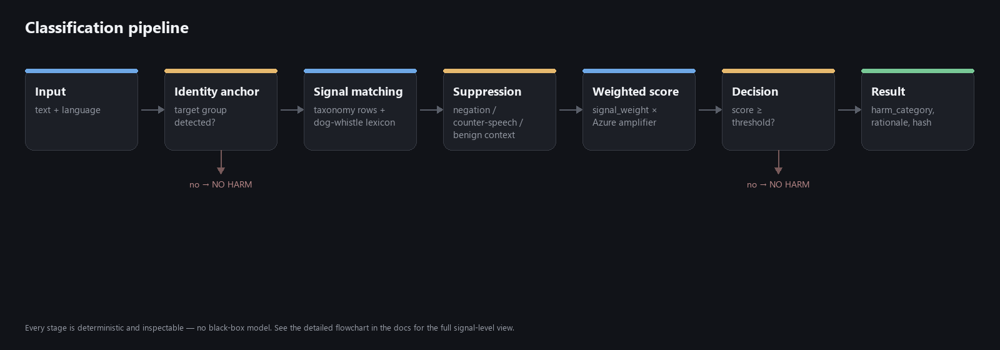
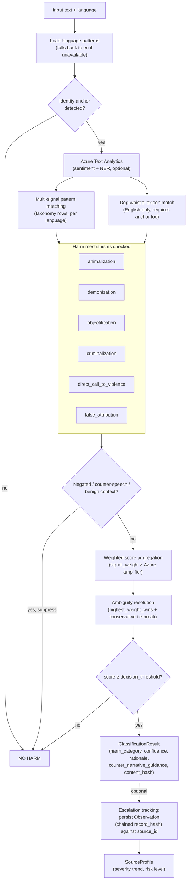
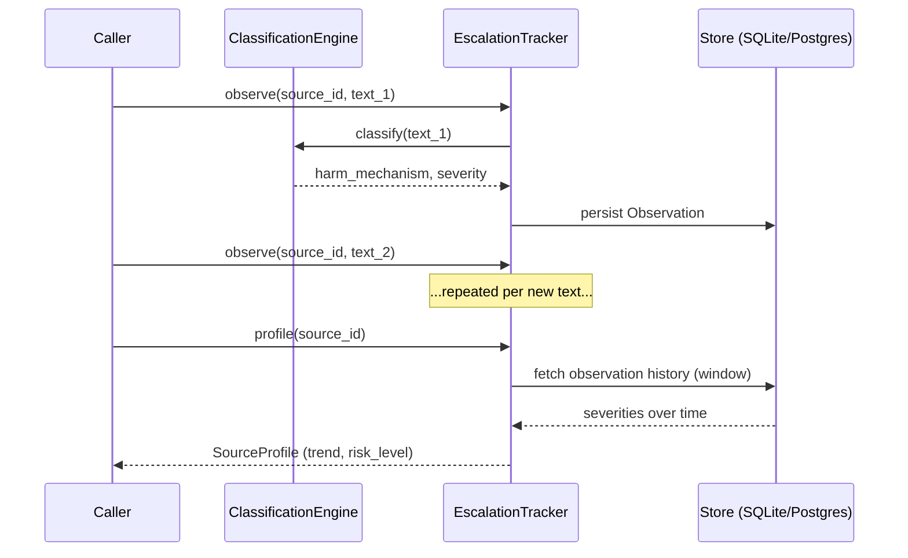

# Architecture



The diagram above is the high-level shape; every stage below expands into the actual signal-level
decision logic.



Escalation tracking, in sequence — a source is scored on trend, not on any single text in isolation:



## Project structure

```text
narrative-harm-classifier/
├── pyproject.toml                 # pip-installable package, console script `nhc`
├── Dockerfile / docker-compose.yml
├── scripts/measure_performance.py # Reproducible latency/memory/throughput measurement
├── narrative_harm_classifier/
│   ├── cli.py                     # `nhc` CLI — classify / serve / track / benchmark
│   ├── api/
│   │   ├── main.py
│   │   └── routes/
│   │       ├── classify.py        # POST /classify + /classify/batch
│   │       ├── validate.py        # POST /validate/dehumanization + /custom
│   │       ├── tracking.py        # POST /tracking/{source_id}/observe|verify, GET /tracking[/{source_id}]
│   │       ├── benchmark.py       # POST /benchmark/run
│   │       └── health.py
│   ├── classifier/
│   │   ├── factory.py             # Shared engine/tracker/runner/validator construction (no duplicated wiring)
│   │   ├── counter_narrative.py   # harm_mechanism -> general counter-messaging guidance
│   │   ├── provenance.py          # content_hash + tamper-evident record_hash chain
│   │   ├── taxonomy/loader.py     # Versioned taxonomy config loader (cached)
│   │   ├── rules/
│   │   │   ├── engine.py          # Core multi-language, multi-signal classification engine
│   │   │   ├── patterns_loader.py # Per-language vocabulary loader (precompiled regex)
│   │   │   ├── dogwhistles.py     # Coded-language lexicon loader + detector
│   │   │   └── azure_nlp.py       # Azure Text Analytics connector (graceful fallback)
│   │   ├── validators/
│   │   │   ├── performance.py     # Legacy 18-sample held-out validator (Phase 1 gate)
│   │   │   ├── benchmark.py       # Templated functional-test benchmark generator + runner
│   │   │   └── i18n_smoke.py      # Per-language smoke test runner
│   │   └── tracking/
│   │       ├── models.py          # Severity ladder, Observation (+ hash chain fields), SourceProfile
│   │       ├── store.py           # SQLAlchemy-backed persistence (SQLite by default, Postgres-ready)
│   │       └── tracker.py         # Trend/risk computation + verify_chain()
│   ├── core/
│   │   ├── config.py              # Settings via env vars (pydantic-settings)
│   │   ├── models.py              # Pydantic request/response schemas
│   │   └── yaml_loader.py         # Shared YAML-load helper (used by every loader above)
│   └── data/
│       ├── taxonomy_v1.yaml           # Versioned taxonomy spec, shipped as package data
│       ├── benchmark_templates.yaml   # Templated benchmark cases, shipped as package data
│       ├── i18n_smoke_tests.yaml      # Small per-language smoke test cases
│       ├── dogwhistles.yaml           # Coded-language lexicon seed list
│       └── patterns/                  # One file per language: en, es, fr, ru, ar, ig, yo, ha
├── tests/
│   ├── unit/                      # Engine, tracking, multilingual, dogwhistle, provenance, CLI tests
│   ├── integration/                # Phase 1 milestone validation gate
│   ├── api/                       # FastAPI route tests
│   └── benchmark/                  # Benchmark structural tests
└── .github/workflows/
```
